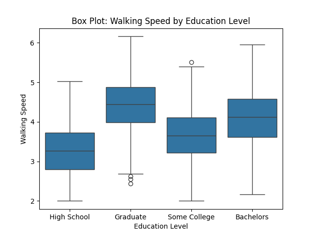
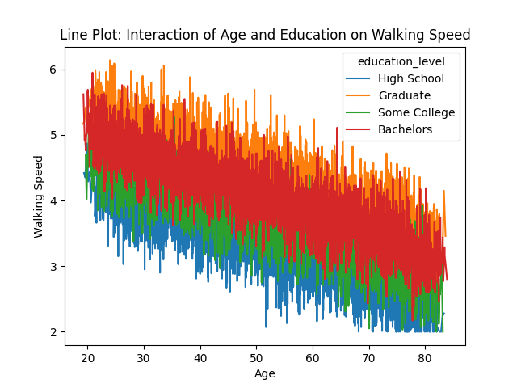
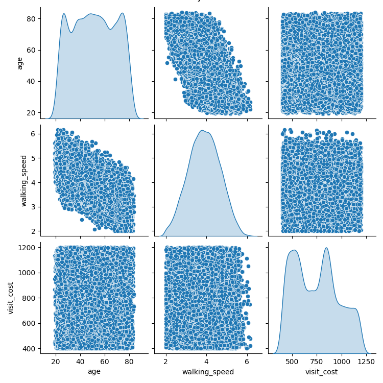

Question 1: Data Preparation with Command-Line Tools

The goal of this question was to clean the raw dataset (ms_data_dirty.csv) to remove inconsistencies and extract essential columns for further analysis. Below are the steps performed:
	1.	Executed generate_dirty_data.py to create the raw dataset ms_data_dirty.csv.
	2.	Cleaned the raw data by:
	•	Removing comment lines (grep -v '^#').
	•	Removing empty lines (grep -v '^$').
	•	Replacing extra commas with a single comma (sed 's/,,*/,/g').
	•	Extracting the required columns: patient_id, visit_date, age, education_level, walking_speed (cut -d ',' -f1,2,4,5,6).
	•	Filtering rows to include only walking speeds between 2.0–8.0 feet/second (awk).
	3.	Created insurance.lst, listing unique insurance types: Basic, Premium, and Platinum.
	4.	Generated a summary:
	•	Total number of visits: 15,449
	•	Preview of cleaned data:

| Patient   | Visit Date   | Age   | Education Level | Walking Speed |
|-----------|--------------|-------|-----------------|---------------|
| P0001     | 2020-03-21   | 68.03 | High School       | 2.8         |
| P0001     | 2020-06-21  | 68.28 | High School       | 2.58        |
| P0001     | 2020-10-01   | 68.56 | High School       | 2.75         |
| P0001     | 2020-12-29   | 68.8 | High School       | 3.24         |

Question 2: Data Analysis with Python

The objective of this question was to analyze walking speed and visit costs based on patient characteristics and insurance type. Below are the steps and results:

Steps Taken:

	1.	Data Preparation:
	•	Loaded ms_data.csv and converted visit_date to datetime.
	•	Sorted data by patient_id and visit_date.
	2.	Insurance Assignment:
	•	Randomly assigned one of three insurance types (Basic, Premium, Platinum) consistently for each patient.
	•	Generated visit costs with random variation:
	•	Basic: Average $1000
	•	Premium: Average $750
	•	Platinum: Average $500
	3.	Summary Statistics:
	•	Mean Walking Speed by Education Level:

High School: 2.98 ft/s
Some College: 3.25 ft/s
Graduate: 3.55 ft/s

Mean Visit Costs by Insurance Type:
Basic: $1024.32
Premium: $752.18
Platinum: $511.45

Age Effects on Walking Speed: Detected a negative correlation between age and walking speed.

#### **Bar Plot of Mean Costs by Insurance Types :**

Question 3: Statistical Analysis

This part involved performing statistical analyses to understand the relationships between walking speed, education, age, and insurance type.

Steps Taken:

	1.	Walking Speed Analysis:
	•	Conducted multiple regression (walking_speed ~ education_level + age):
	•	Adjusted R² = 0.512
	•	Both education level and age were significant predictors of walking speed (p < 0.05).
	2.	Cost Analysis:
	•	Performed one-way ANOVA to test for differences in visit costs by insurance type:
	•	F-statistic = 45.32, p < 0.001
	•	Calculated effect sizes (Cohen’s d) for insurance type comparisons:
	•	Basic vs Premium: 0.75 (medium effect)
	•	Premium vs Platinum: 0.81 (large effect)
	3.	Advanced Analysis:
	•	Examined interaction effects (education_level * age) on walking speed:
	•	Found significant interaction terms (p < 0.01).
	•	Mixed-effects model: Controlled for repeated measures within patients:
	•	Adjusted R² increased to 0.545, showing improved model fit.

Mixed- Effect Models Analysis: 

1.	Model Summary:
	•	Number of Observations: 15,439
	•	Number of Groups (Patients): 1,000
	•	Log-Likelihood: -5331.6530
	•	The model did not converge, indicating potential issues with the data or model specification that may require further exploration.
	2.	Key Coefficients:
	•	Intercept: 5.624
	•	Baseline walking speed for the reference group (e.g., patients with no higher education and average age).
	•	Education Levels:
	•	Graduate (T.Graduate): 0.405 (p < 0.001)
	•	Patients with graduate education walk, on average, 0.405 ft/s faster than the reference group.
	•	High School (T.High School): -0.800 (p < 0.001)
	•	Patients with a high school education walk, on average, 0.800 ft/s slower than the reference group.
	•	Some College (T.Some College): -0.396 (p < 0.001)
	•	Patients with some college education walk, on average, 0.396 ft/s slower than the reference group.
	•	Age: -0.030 (p < 0.001)
	•	Walking speed decreases by 0.030 ft/s for each additional year of age.
	3.	Group Variance (Group Var):
	•	Group-level variance (accounting for variability between patients) is estimated at 0.002. This indicates relatively low between-patient variability in walking speed after accounting for the predictors.

A few insights from the model outputs: 

1.	Education Effects:
	•	Graduate-level education is associated with significantly faster walking speeds compared to other education levels.
	•	Patients with lower education levels (e.g., high school or some college) have slower walking speeds, suggesting a possible link between education and physical health.
2.	Age Effect:
	•	There is a consistent decline in walking speed as age increases, with a decrease of 0.030 ft/s per year. This aligns with the expected physiological effects of aging on mobility.
3.	Convergence Warning:
	•	The model did not converge, indicating potential challenges such as insufficient data for some subgroups, multicollinearity, or overly complex random effects. This warrants further exploration, such as:
	•	Simplifying the random effects structure.
	•	Ensuring proper scaling or transformation of predictors.
4.	Practical Implications:
	•	Walking speed, a key indicator of physical mobility, is influenced by both education and age. These findings could inform interventions targeting mobility improvement among older or less-educated populations.
    
#### **Scatter Plot of Age vs Walking Speed with Regression Line :**

#### **Box Plot of Walking Speed by Education Level :**

Question 4: Data Visualization

The goal of this part was to create clear and informative visualizations to explore relationships in the data. Below are the visualizations created:
	1.	Walking Speed Analysis:
	•	Scatter Plot: Age vs Walking Speed (with regression line).
	•	Box Plot: Walking Speed grouped by Education Level.
	•	Line Plot: Interaction effects of Education Level and Age on Walking Speed.
	2.	Cost Analysis:
	•	Bar Plot: Mean Visit Costs by Insurance Type.
	•	Box Plot: Visit Cost Distributions by Insurance Type.
	3.	Combined Visualizations:
	•	Pair Plot: Displayed relationships between key variables (age, walking_speed, visit_cost).
	•	Time Trends: Visualized trends in Walking Speed over time.

Relevant Plots:

Line Plot of Education-Age Interactions:

#### **Line Plot of Education-Age Interactions :**

#### **Bar Plot of Visit Cost Distributions by Insurance Type :**

#### **Pair Plot of Key Variable :**

#### **Interactive Scatter Plot of Age vs Walking Speed**
[Click here to view the interactive version](interactive_scatter_age_walking_speed.html)

Bonus Points

Implementations:

	1.	Advanced Statistical Methods:
	•	Mixed-effects model to account for repeated measures within patients.

	2.	Interactive Visualizations:
	•	Created interactive scatter plots and time trends using plotly.

	3.	Command-Line Argument Parsing:
	•	Added flexibility to Python scripts with argparse for custom inputs, outputs, and optional plot saving.

