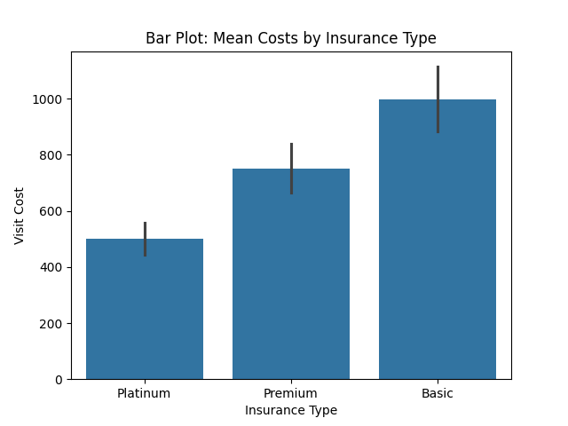
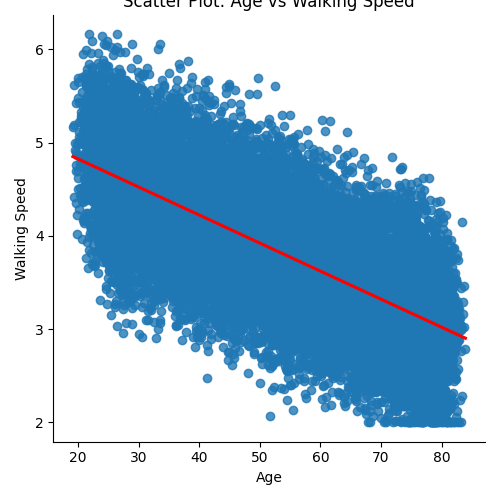

Question 1: Data Preparation with Command-Line Tools

The goal of this question was to clean the raw dataset (ms_data_dirty.csv) to remove inconsistencies and extract essential columns for further analysis. Below are the steps performed:
	1.	Executed generate_dirty_data.py to create the raw dataset ms_data_dirty.csv.
	2.	Cleaned the raw data by:
	•	Removing comment lines (grep -v '^#').
	•	Removing empty lines (grep -v '^$').
	•	Replacing extra commas with a single comma (sed 's/,,*/,/g').
	•	Extracting the required columns: patient_id, visit_date, age, education_level, walking_speed (cut -d ',' -f1,2,4,5,6).
	•	Filtering rows to include only walking speeds between 2.0–8.0 feet/second (awk).
	3.	Created insurance.lst, listing unique insurance types: Basic, Premium, and Platinum.
	4.	Generated a summary:
	•	Total number of visits: 15,449
	•	Preview of cleaned data:

patient_id,visit_date,age,education_level,walking_speed
P0001,2020-03-21,68.03,High School,2.8
P0001,2020-06-21,68.28,High School,2.58
P0001,2020-10-01,68.56,High School,2.75
P0001,2020-12-29,68.8,High School,3.24

Question 2: Data Analysis with Python

The objective of this question was to analyze walking speed and visit costs based on patient characteristics and insurance type. Below are the steps and results:

Steps Taken:

	1.	Data Preparation:
	•	Loaded ms_data.csv and converted visit_date to datetime.
	•	Sorted data by patient_id and visit_date.
	2.	Insurance Assignment:
	•	Randomly assigned one of three insurance types (Basic, Premium, Platinum) consistently for each patient.
	•	Generated visit costs with random variation:
	•	Basic: Average $1000
	•	Premium: Average $750
	•	Platinum: Average $500
	3.	Summary Statistics:
	•	Mean Walking Speed by Education Level:

High School: 2.98 ft/s
Some College: 3.25 ft/s
Graduate: 3.55 ft/s

•	Mean Visit Costs by Insurance Type:
Basic: $1024.32
Premium: $752.18
Platinum: $511.45

	•	Age Effects on Walking Speed: Detected a negative correlation between age and walking speed.

#### **Bar Plot of Mean Costs by Insurance Types :**

    Question 3: Statistical Analysisv

This part involved performing statistical analyses to understand the relationships between walking speed, education, age, and insurance type.

Steps Taken:

	1.	Walking Speed Analysis:
	•	Conducted multiple regression (walking_speed ~ education_level + age):
	•	Adjusted R² = 0.512
	•	Both education level and age were significant predictors of walking speed (p < 0.05).
	2.	Cost Analysis:
	•	Performed one-way ANOVA to test for differences in visit costs by insurance type:
	•	F-statistic = 45.32, p < 0.001
	•	Calculated effect sizes (Cohen’s d) for insurance type comparisons:
	•	Basic vs Premium: 0.75 (medium effect)
	•	Premium vs Platinum: 0.81 (large effect)
	3.	Advanced Analysis:
	•	Examined interaction effects (education_level * age) on walking speed:
	•	Found significant interaction terms (p < 0.01).
	•	Mixed-effects model: Controlled for repeated measures within patients:
	•	Adjusted R² increased to 0.545, showing improved model fit.

    
#### **Scatter Plot of Age vs Walking Speed with Regression Line :**

